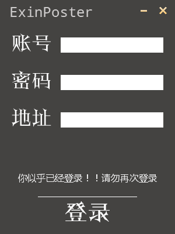

# aardio无线e信portal登录协议

## 代码
```
import win.ui;
import crypt.aes;
import inet.http;
/*DSG{{*/
mainForm = win.form(text="无线e信登录";right=299;bottom=399;image=$"\res\mainForm.jpg";bkBottom=0;bkLeft=0;bkRight=0;bkTop=0;border="none")
mainForm.add(
btLogin={cls="plus";left=0;top=328;right=300;bottom=403;background="\res\登录.png";z=4};
btnClose={cls="plus";left=264;top=0;right=294;bottom=36;background="C:\Users\Administrator\Desktop\plus.新年快乐\res\close-default.png";notify=1;z=5};
btnMin={cls="plus";left=232;top=0;right=262;bottom=36;background="C:\Users\Administrator\Desktop\plus.新年快乐\res\min-default.png";z=6};
etIP={cls="edit";left=104;top=192;right=280;bottom=218;font=LOGFONT(name='微软雅黑';h=-16);tabstop=1;z=11};
etPassword={cls="edit";left=104;top=128;right=280;bottom=154;font=LOGFONT(name='微软雅黑';h=-16);tabstop=1;z=10};
etUsername={cls="edit";left=104;top=64;right=280;bottom=90;font=LOGFONT(name='微软雅黑';h=-16);tabstop=1;z=9};
plus={cls="plus";left=16;top=48;right=91;bottom=98;background="\res\账号.png";z=1};
plus2={cls="plus";left=16;top=112;right=91;bottom=162;background="\res\密码.png";z=2};
plus3={cls="plus";left=16;top=176;right=91;bottom=226;background="\res\地址.png";z=3};
plus4={cls="plus";left=16;top=8;right=216;bottom=44;background="\res\ExinPoster.png";z=7};
stcInfo={cls="plus";left=0;top=280;right=300;bottom=330;background="\res\info.png";color=16777215;font=LOGFONT(name='微软雅黑';h=-16);z=8}
)
/*}}*/

//最小化按钮样式
mainForm.btnMin.skin( 
	background = { 
		hover = "/res/min-hover.png";
		active = "/res/min-active.png"; 
		default = "/res/min-default.png"; 
	}
)

//关闭按钮样式
mainForm.btnClose.skin(
	background = { 
		hover = "/res/close-hover.png";
		active = "/res/close-active.png";
		default = "/res/close-default.png"; 
	}
)

//下载按钮样式
mainForm.btLogin.skin(
		background = { 
		hover = "/res/登录-hover.png";
		active = "/res/登录.png";
	}
)

//最小化按钮
mainForm.btnMin.oncommand = function(id,event){
	mainForm.hitmin()
} 

//关闭按钮
mainForm.btnClose.oncommand = function(id,event){
	mainForm.close()
}

//主要登录逻辑
mainForm.btLogin.oncommand = function(id,event){
    var userip = mainForm.etUsername.text;
    if (userip!=""){
		mainForm.stcInfo.text = "开始登录....";
	}
	var poUsername = mainForm.etIP.text;
	var poPassword = encrypt(mainForm.etPassword.text);
	var uuid = getUUID(userip);
	if (userip!="" && poUsername!="" && poUsername!="") {
		var loginCode = getLoginCode(uuid,userip,poUsername,poPassword);
		if (loginCode == "200") {
			mainForm.stcInfo.text = "登录成功:200";
		}
	}
}

//获取localip
getLocalIP = function(){
	var http = inet.http();
	var redirectURL = http.location("http://59.37.96.63:80");
	if (redirectURL == "http://59.37.96.63:80") {
		mainForm.stcInfo.text = "你似乎已经登录！！请勿再次登录";
		return ""; 
	}
	var localIP = string.match( redirectURL,"userip=(.+?)&wlanacname" );
	return localIP; 
}

//初始窗口即开始获取localip
mainForm.etUsername.text = getLocalIP();


//密码加密
encrypt = function(password){
    //初始向量byte[16]内容全为0
    var aes = crypt.aes('\0\0\0\0\0\0\0\0\0\0\0\0\0\0\0\0');
    //7%ChIna3#@Net*%原始md5 hash数据值，即未转换成16进制
    var key = crypt().createHashByMd5("7%ChIna3#@Net*%").getValue();
    aes.setPassword(key);
    var sstr = aes.encrypt(password);
	return string.hex(sstr,"",);
}

//获取uuid
getUUID = function(userip){
	var http = inet.http("China Telecom Client");
	var html,err,errCode = http.post("http://61.183.0.136:8880/security.do","wlanuserip="+userip);
	uuid = string.match( html,"\<Uuid\>(.+?)\</Uuid\>");
	return uuid; 
}

//登录并返回ResponseCode
getLoginCode = function(uuid,userip,poUsername,poPassword){
	var postDATA = {
		uuid = uuid;
		userip = userip;
		username = poUsername;
		password = poPassword;
		ratingtype = 1;
	};
	var http = inet.http("China Telecom Client");
	var html,err,errCode = http.post("http://61.183.0.136:8880/login.do",postDATA);
	var responseCode = string.match( html,"\<ResponseCode\>(\d{3})\</ResponseCode\>" );
	return responseCode; 
}

//添加下面的代码以支持鼠标拖动窗体
mainForm.wndproc = {
	[ 0x201/*_WM_LBUTTONDOWN*/ ] = function(hwnd,message,wParam,lParam){
		mainForm.hitCaption();
	}
} 

import win.ui.resizeBorder;
win.ui.resizeBorder(mainForm)

mainForm.show();
return win.loopMessage(); 
```

## 预览图


## 代码附件
具体见[附件](./_v_attachments/1514625095_25123/无线e信协议拨号.7z)